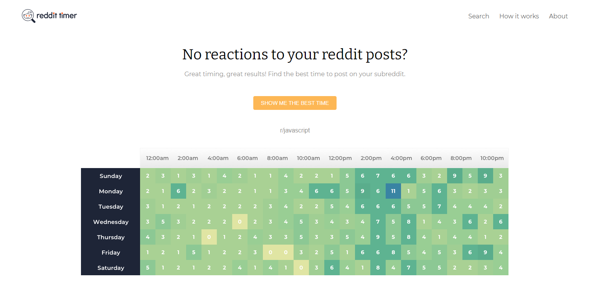
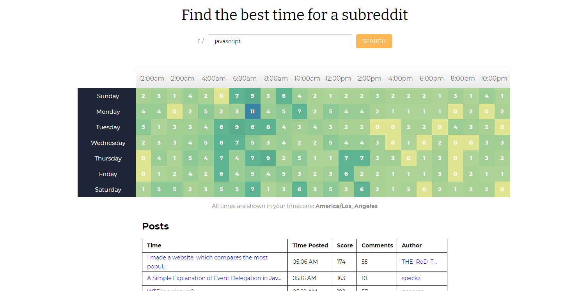

# Subreddit Timer App

I developed a heatmap to show users when is the best time to post in a given subreddit.

## Description

I implemented this project during a course at [ooloo.io](https://ooloo.io/) which mimics a professional real-world agile development environment. The course was created by [Johannes Kettmann](https://jkettmann.com/about/), a senior Software Engineer.

Designs were provided via Zeplin. The project tasks followed a Kanban style of agile development using ClickUp for project management.

The application, Subreddit Timer, solves the problem for reddit users who are deciding when is the best time to post on a subreddit.

To accomplish this, I utilized the Reddit API to retrieve the top 500 posts for a subreddit and implemented a heatmap to organize when the posts were created.

This provides users with the data visualization needed to determine when is the most popular time to post. Users can then click on any area of the heatmap to view the top posts for that time of the day.

## Skills Learned

To implement this project, I used the React library for implementing the components for the user interface. To ensure code quality, I implemented integration tests with React Testing Library and Jest.

Below includes the skills and technologies used to build the Subreddit Timer application.

* Planned and implemented a complex UI component (Heatmap)
* Professional Git workflow with pull requests 
* Created components based on wireframe designs
* Implemented asynchronous data fetching with error handling
* Wrote integration tests to ensure code quality
* Styled Components for organizing CSS styles
* Debugging with VSCode 
* PropTypes and Linting
* React Router

## Structure of code 

The project was created with the Create React App setup.

Within the src directory, I have organized the project components into the pages folder and components folder.

To view the component responsible for the Search page and handling the response from the Reddit API, click [here](https://github.com/ooloo-io/reddit-timer-react-stevenGarciaDev/blob/master/src/pages/search/search.js).

To view the Styled Components and CSS associated with styling the heatmap, click [here](https://github.com/ooloo-io/reddit-timer-react-stevenGarciaDev/blob/master/src/components/heatmap/heatmap.styles.js).

My implementation for the heatmap component can be viewed [here](https://github.com/ooloo-io/reddit-timer-react-stevenGarciaDev/blob/master/src/components/heatmap/heatmap.js).

The integration tests written for the components can be viewed [here](https://github.com/ooloo-io/reddit-timer-react-stevenGarciaDev/tree/master/src/__tests__).

I developed a recursive implementation for the HTTP GET request to the Reddit API as it sets 100 as the maximum amount of subreddit posts to be retrieved 
for a GET request. The requirements for the heatmap was to have 500 subreddit posts, which made a recursive implementation a clean way to accomplish this. The API service call to the Reddit API can be viewed [here](https://github.com/ooloo-io/reddit-timer-react-stevenGarciaDev/blob/master/src/services/subredditService.js).

## Instructions

You can view the application [here](https://subreddit-timer.netlify.app).

If you wish to run it locally, the steps may be followed below.

## Clone the project
### `git clone https://github.com/stevenGarciaDev/subreddit-timer`

## Install
### `yarn install`

## Run locally
### `yarn start`

## Run tests

### `yarn test`

## Author

Steven Garcia

* Website: [https://stevengarciadev.github.io/](https://stevengarciadev.github.io/)
* LinkedIn: [https://www.linkedin.com/in/stevengarciadev/](https://www.linkedin.com/in/stevengarciadev/)

Special Thanks to ooloo.io and Johannes Kettmann.

